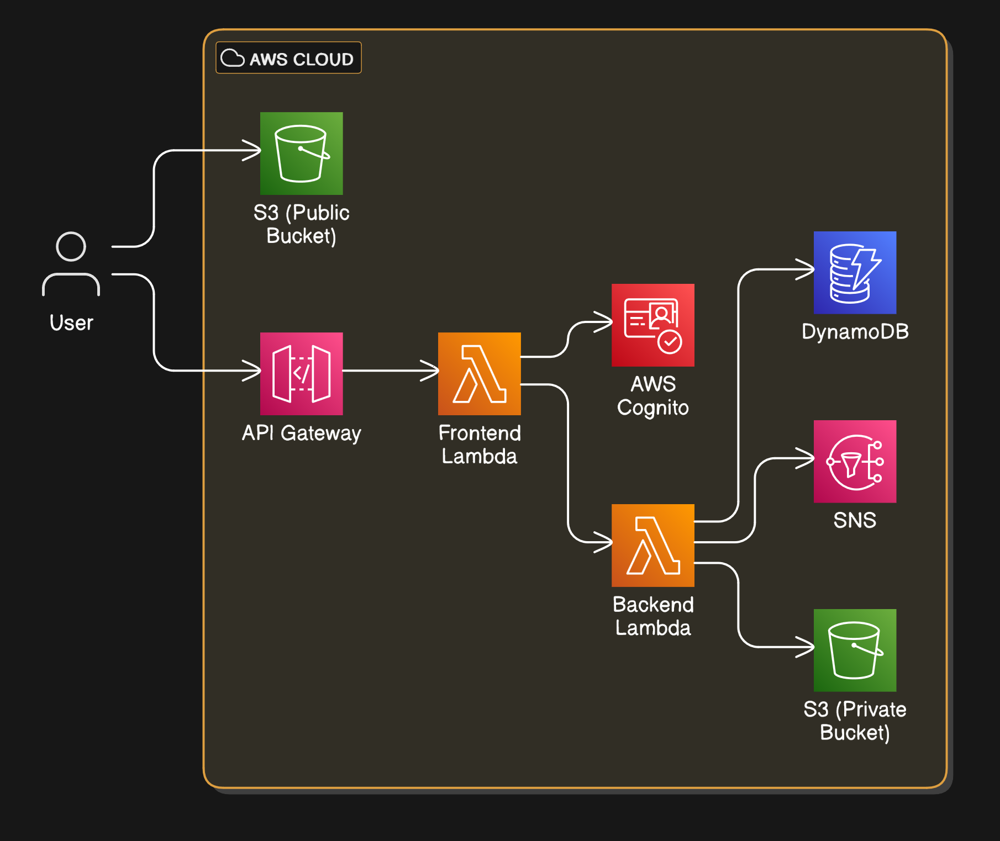
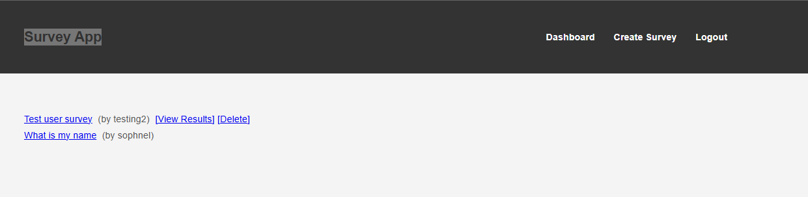

# Fully Serverless Survey Application on AWS


You can get more details from my blog article --> 
This repository contains a fully serverless web application built from scratch on AWS using Python. The application allows users to register, log in, create surveys, submit responses, and view results. It leverages the following AWS services:

- **Amazon Cognito** for user authentication and JWT token issuance.
- **Amazon S3** for hosting the frontend (public bucket) and storing private assets (private bucket).
- **Amazon API Gateway** for exposing RESTful endpoints to the frontend.
- **AWS Lambda** (two separate functions: a frontend "gatekeeper" Lambda and a backend "logic" Lambda) for all application logic.
- **Amazon DynamoDB** for storing survey definitions and responses.
- **Amazon SNS** for sending notifications on certain events (e.g., survey deletion).
- **Amazon CloudWatch** for logs and metrics, ensuring visibility and easier troubleshooting.

All resources are managed using **Terraform**, providing Infrastructure as Code (IaC) that can bring up or tear down the entire environment with a single command.

## Repository Structure

├── main.tf
├── modules
│   ├── api_gateway
│   │   ├── main.tf
│   │   ├── outputs.tf
│   │   └── variables.tf
│   ├── cloudwatch
│   │   ├── main.tf
│   │   ├── outputs.tf
│   │   └── variables.tf
│   ├── cognito
│   │   ├── main.tf
│   │   ├── outputs.tf
│   │   └── variables.tf
│   ├── dynamodb
│   │   ├── main.tf
│   │   ├── outputs.tf
│   │   └── variables.tf
│   ├── frontend
│   │   ├── flask_function
│   │   │   ├── app.py
│   │   │   ├── flask_function.zip
│   │   │   ├── package
│   │   │   │   ├── app.py
│   │   │   │   ├── six.py
│   │   │   │   ├── static
│   │   │   │   │   ├── css
│   │   │   │   │   │   └── styles.css
│   │   │   │   │   └── images
│   │   │   │   ├── templates
│   │   │   │   │   ├── create_survey.html
│   │   │   │   │   ├── dashboard.html
│   │   │   │   │   ├── index.html
│   │   │   │   │   ├── register.html
│   │   │   │   │   ├── survey.html
│   │   │   │   │   └── survey_responses.html
│   │   │   │   └── wsgi.py
│   │   │   ├── requirements.txt
│   │   │   ├── static
│   │   │   │   ├── css
│   │   │   │   │   └── styles.css
│   │   │   │   └── images
│   │   │   ├── templates
│   │   │   │   ├── create_survey.html
│   │   │   │   ├── dashboard.html
│   │   │   │   ├── index.html
│   │   │   │   ├── login.html
│   │   │   │   ├── register.html
│   │   │   │   └── survey.html
│   │   │   └── wsgi.py
│   │   ├── main.tf
│   │   ├── outputs.tf
│   │   └── variables.tf
│   ├── iam
│   │   ├── main.tf
│   │   ├── outputs.tf
│   │   └── variables.tf
│   ├── lambda
│   │   ├── lambda_function
│   │   │   ├── lambda_function.zip
│   │   │   ├── main.py
│   │   │   ├── packages
│   │   │   │   ├── main.py
│   │   │   │   └── six.py
│   │   │   ├── requirements.txt
│   │   │   └── six.py
│   │   ├── main.tf
│   │   ├── outputs.tf
│   │   └── variables.tf
│   ├── s3
│   │   ├── main.tf
│   │   ├── outputs.tf
│   │   └── variables.tf
│   └── sns
│       ├── main.tf
│       ├── outputs.tf
│       └── variables.tf
├── outputs.tf
└── variables.tf

Each module sets up a piece of the architecture (e.g., Cognito user pool, DynamoDB tables, API Gateway routes, etc.). The root `main.tf` references these modules and ties everything together.

## High-Level Architecture


1. **Cognito** authenticates users and returns JWT tokens upon successful login.
2. The **public S3 bucket** serves the HTML/CSS/JS frontend to the user's browser.
3. The user interacts with the application by sending requests (e.g., creating a survey) to **API Gateway** endpoints.
4. All API calls first pass through the **frontend Lambda**, which validates JWT tokens and checks permissions. Only then does it invoke the **backend Lambda** if needed.
5. The **backend Lambda** manages surveys and responses, using **DynamoDB** for storage. For certain events (like survey deletion), it sends notifications to **SNS**.
6. **CloudWatch** provides logging and metrics for both Lambdas, API Gateway, and DynamoDB, aiding in monitoring and troubleshooting.

This layered approach ensures that the backend Lambda is never directly accessible from the internet, adding a security and logic “gatekeeper” layer in the frontend Lambda.

## Prerequisites

- **Terraform** installed (v1.0+ recommended).
- **AWS CLI** configured with appropriate credentials.
- **Zip tool** (e.g., `zip`) for packaging Lambda code.
- **Python 3.x** and `pip` for installing Lambda dependencies.
  
You should also have an S3 bucket or know how to specify one for Terraform to store the Lambda ZIP files if referencing them externally. Alternatively, you can keep the ZIPs local and let Terraform upload them.

## Preparing Lambda Code

### Frontend Lambda

- Go to `modules/frontend/flask_function/package/`.  
- In this directory, you have `requirements.txt` and your Python code (including `app.py`, `templates/`, and `static/`).
- Install dependencies locally:
  ```bash
  cd modules/frontend/flask_function/package/
  pip install -r requirements.txt -t .

This command installs all dependencies into the current directory.

Once dependencies are installed, package the code and dependencies:

    zip -r9 ../flask_function.zip .


This command creates `flask_function.zip` one level above, including all code, dependencies, templates, and static files.

Verify `flask_function.zip` is now in `modules/frontend/flask_function/`.

### Backend Lambda

- Go to `modules/lambda/lambda_function/packages/`.
- Similar process as the frontend:

    ```bash
    cd modules/lambda/lambda_function/packages/
    pip install -r ../requirements.txt -t .
- After installing dependencies, zip the code:

    ```bash
    zip -r9 ../lambda_function.zip .
    ```

    Verify `lambda_function.zip` is created one level above, inside `modules/lambda/lambda_function/`.

**Important:** Ensure these steps are done before running `terraform apply`, so Terraform references the correct ZIP files.

## Applying Terraform

- Initialize Terraform:

    ```bash
    terraform init
    ```

- Plan changes:

    ```bash
    terraform plan
    ```

    This shows what Terraform will create or change. Review to ensure correctness.

- Apply changes:

    ```bash
    terraform apply
    ```

    Confirm by typing `yes` when prompted. Terraform will create all AWS resources in the correct order.

    When the process finishes, Terraform outputs useful information, like API Gateway endpoints, Cognito user pool details, etc.

## Post-Deployment Steps

1. **Access the frontend** by navigating to the S3 public bucket URL. You’ll see the main page, ready for sign-up and login.
2. **Sign up or log in.** The frontend will send credentials through the API Gateway -> frontend Lambda -> Cognito flow.
3. **Interact with the application.** Once authenticated, you can create surveys, submit responses, and fetch results. All calls to create/fetch go through API Gateway and Lambdas, with DynamoDB as the persistent data store.

## Monitoring & Observability

- **CloudWatch Logs:** Check Lambda and API Gateway logs in CloudWatch for debugging. Each Lambda has its own log group.

## Troubleshooting

- **CORS Issues:** If the browser complains about CORS, review the API Gateway method and integration response headers. Terraform code should set `Access-Control-Allow-Origin` and others. Adjust as needed and `terraform apply` again.
- **JWT Validation Errors:** Ensure the frontend Lambda is correctly validating JWT tokens by fetching Cognito JWKS. Check your Python code and logs to confirm.
- **Permission Denied on Private S3 Access:** Make sure IAM roles defined in Terraform allow the frontend Lambda to `s3:GetObject` on the private bucket. Adjust policies in `modules/iam` or where they’re defined.
- **DynamoDB Throttling:** If load tests cause throughput issues, consider DynamoDB's on-demand capacity. Update Terraform and `terraform apply` to handle unexpected spikes.
- **SNS Not Sending Notifications:** Verify subscriptions and the SNS topic name. Check logs to confirm the backend Lambda publishes messages correctly.